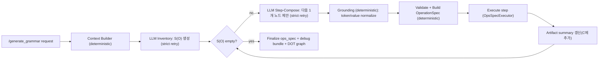

# Recursive Grammar 파이프라인 문서 (Inventory + Step-Compose)

이 문서는 `nlp_server`의 **현재 구현 상태** 기준으로, 자연어 입력이 어떤 모듈/스텝을 거쳐 최종 OpsSpec(=grammar) DAG로 합성되는지 설명합니다. (수정 “계획” 문서가 아닙니다.)

`/generate_grammar`가 어떤 코드 경로를 거치는지(파일/함수 단위)는 `docs/generate_grammar_call_flow.md`를 참고하세요.

핵심 특징:
- 결과는 항상 **node/edge(meta.nodeId/meta.inputs)** 를 가진 DAG
- explanation에서 **S(O)=연산 태스크 집합**을 만든 뒤, “가능한 것 1개씩” 실행하며 그래프를 확정(forward-chaining)
- LLM 출력은 항상 **strict JSON + Pydantic 스키마 + 계약 기반 validator** 로 검증하고 실패 시 strict retry
- nodeId는 실행 순서대로 **안정적(stable)으로 `n1,n2,...` 부여** (id 재작성 canonicalize는 사용하지 않음)

---

## 0) 엔드포인트 계약 (Public API)

- Endpoint: `main.py`
  - `POST /generate_grammar`: `question + explanation + vega_lite_spec + data_rows (+ debug)` → `{<opsSpec group map>, "draw_plan": <draw group map>}`
  - `POST /run_module_trace`: 위 입력을 파일 경로로 받아, inventory/step trace를 포함한 디버그 응답 반환

파이프라인 오케스트레이션(모듈 호출/재시도/실행/디버그 번들 저장):
- `opsspec/modules/pipeline.py`

---

## 1) 핵심 데이터 구조

### 1-1) ChartContext (결정론적 컨텍스트)

- 정의: `opsspec/core/models.py`
- 생성: `opsspec/runtime/context_builder.py`
  - `primary_dimension`, `primary_measure`, `series_field`
  - `categorical_values[field]` (도메인 목록), `numeric_stats`, `field_types`, `mark`, `is_stacked`, ...

### 1-2) Inventory = S(O) (LLM이 뽑는 “연산 태스크”)

- 모델: `opsspec/core/recursive_models.py`
  - `OpTask(taskId="o1", op="average", sentenceIndex=1, mention="...", paramsHint={...})`
- 모듈: `opsspec/modules/module_inventory.py`
  - sentence split: `split_explanation_sentences`
- 프롬프트:
  - `prompts/opsspec_inventory.md`
  - shared rules: `prompts/opsspec_shared_rules.md`

규칙(요약):
- 동일 op라도 “설명에서 언급된 역할/부분이 다르면” 다른 taskId를 부여(=태스크 단위는 문장 의미 단위)
- `taskId`는 반드시 `o<digits>`이고 유니크해야 함(validator 강제)
- `paramsHint`는 prompting 안정성을 위해 **flat(스칼라/스칼라 리스트)** 만 허용(validator 강제)

### 1-3) Step trace (연구 재현성을 위한 구조적 기록)

- 모델: `opsspec/core/models.py`
  - `RecursivePipelineTrace`, `RecursiveStepTrace`
- `/run_module_trace`는 이 trace에서:
  - `inventory` (S(O))
  - `steps` (각 step의 선택된 task, grounded spec 요약, artifact 요약)
  - `ops_spec` (최종 그래프)
  - 를 반환합니다.

### 1-4) OpsSpec group map = 최종 DAG

- Union/파서:
  - `opsspec/specs/union.py`
- 공통 meta 필드:
  - `opsspec/specs/base.py`

핵심 규칙:
- 각 op는 `meta.nodeId`와 `meta.inputs`로 DAG 연결이 복원 가능해야 함
- cross-node scalar reference는 `"ref:nX"` **문자열만** 허용 (객체 `{ "id": "nX" }` 금지)
- group 이름은 “series branch”가 아니라 **explanation sentence layer**:
  - `sentenceIndex=1 → "ops"`
  - `sentenceIndex=k → "ops{k}" (k>=2)`

---

## 2) 전체 파이프라인 개요

구현 entrypoint:
- `opsspec/modules/pipeline.py` (`OpsSpecPipeline.generate`)

---

## 3) Step 0 — Context Builder (deterministic)

코드:
- `opsspec/runtime/context_builder.py`

입력:
- `vega_lite_spec`
- `data_rows`

출력:
- `ChartContext`
- `context_warnings`
- `rows_preview` (LLM prompting/debug용)

---

## 4) Module — Inventory (LLM + strict retry)

코드:
- `opsspec/modules/module_inventory.py`

검증:
- `opsspec/validation/recursive_validators.py`
  - `validate_inventory`

입력(프롬프트에 포함되는 것):
- `question`, `explanation`, sentence-split 결과
- `chart_context_json`, `rows_preview_json`
- op 계약(JSON): `opsspec/runtime/op_registry.py` (`build_ops_contract_for_prompt`)

출력:
- `inventory.tasks[]` (S(O))

실패/재시도:
- inventory schema/validator 위반 시 feedback을 넣고 `RECURSIVE_MAX_RETRIES`까지 strict retry

---

## 5) Recursive loop (Step-Compose → Ground → Validate → Execute)

### 5-1) Module — Step-Compose (LLM + strict retry)

코드:
- `opsspec/modules/module_step_compose.py`

프롬프트:
- `prompts/opsspec_step_compose.md`

출력 스키마(요약):
- `pickTaskId`: 남은 task 중 1개
- `op_spec`: id/meta/chartId 없이, op-specific 필드만 포함
- `inputs`: 이미 실행된 nodeId만

검증(계약 기반):
- `opsspec/validation/recursive_validators.py`
  - `validate_step_compose_output`
  - 금지: `{ "id": "nX" }` 객체 ref, `id/meta/chartId` 포함 등

### 5-2) Grounding (deterministic)

코드:
- `opsspec/runtime/grounding.py`
  - role token 치환: `@primary_measure/@primary_dimension/@series_field`
  - 도메인 값 정규화: exact → case-insensitive → difflib fuzzy(cutoff=0.8)

### 5-3) Build + Validate OperationSpec (deterministic)

코드:
- 파싱: `parse_operation_spec` in `opsspec/specs/union.py`
- 의미 검증: `validate_operation` in `opsspec/validation/validators.py`

pipeline이 결정론적으로 부여하는 필드:
- `nodeId = n1,n2,...` (실행 순서)
- `id = nodeId`
- `meta.sentenceIndex = task.sentenceIndex`
- `meta.inputs = sorted(unique(inputs ∪ scalar_ref_deps))`
- `meta.source = "recursive_step=<k>;taskId=<oX>"`

### 5-4) Execute + Artifact summary

- 실행기: `opsspec/runtime/executor.py`
  - 모르는 op는 `NotImplementedError`로 fail-fast
- artifact 요약:
  - `opsspec/runtime/artifacts.py`
  - executor runtime에서 scalar/table 출력의 compact summary를 만들고, 다음 step-compose prompting에 사용

### 5-5) Normalize (stable IDs 유지)

코드:
- `opsspec/runtime/normalize.py`
  - id/nodeId 재작성 없이 `meta.inputs`만 결정론적으로 정규화(중복 제거/정렬, scalar deps 포함)

### 5-6) 종료 조건

- 남은 tasks가 비면 종료
- `RECURSIVE_MAX_STEPS`를 넘기면 fail-fast (디버그 번들에 남은 tasks 기록)

---

## 6) Debug 번들(요청별 산출물)

`debug=true`일 때 성공 요청은 번들을 저장하고, 실패한 요청은 debug 설정과 무관하게 원인 추적을 위한 `99_error.json` 번들을 남깁니다.

저장 위치:
- `opsspec/debug/<MMddhhmm>/`

대표 파일:
- `00_trace.md` (inventory 변화 + step별 트리 스냅샷)
- `00_request.json`
- `01_context.json`
- `02_inventory.json` (LLM raw + prompt path/sha256 + llm config + validator 결과 포함)
- per-step:
  - `03_step_01_compose.json`
  - `04_step_01_grounded.json`
  - `05_step_01_op.json`
  - `06_step_01_exec.json`
- `90_final_grammar.json`
- `91_tree_ops_spec.dot` (+ Graphviz가 있으면 `.svg/.png`)
- `95_draw_plan.json` (옵션)
- `99_error.json` (실패한 경우)

구현:
- `_persist_debug_bundle` in `opsspec/modules/pipeline.py`

---

## 7) operation 추가 시 변경 포인트 (contract-first)

새 op 추가 시 “필수로” 건드려야 하는 포인트:
1) Spec 모델 추가: `opsspec/specs/<new_op>.py`
2) Union 등록: `opsspec/specs/union.py`
3) 계약 등록: `opsspec/runtime/op_registry.py`
4) 의미 검증 추가: `opsspec/validation/validators.py`
5) 실행기 구현: `opsspec/runtime/executor.py`

중요:
- inventory/step-compose validator는 `build_ops_contract_for_prompt()`의 계약을 동적으로 사용하므로, pipeline 자체는 대부분 수정하지 않습니다.
- executor는 모르는 op를 조용히 넘기지 않고 즉시 실패해야 합니다(누락이 바로 드러나도록).

---

## 8) 환경 변수(하드코딩 금지)

- `RECURSIVE_MAX_STEPS` (default: 25)
- `RECURSIVE_MAX_RETRIES` (default: 3)
- `ARTIFACT_PREVIEW_N` (default: 5)
