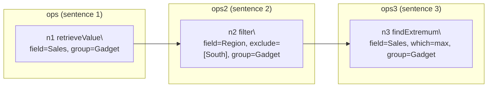

# 자연어(Question+Explanation) → OpsSpec(Grammar) 변환 과정 (Step-by-step 예시)

이 문서는 업데이트된 **3-Module + (Module 2의 4-step)** 구조에서, 자연어 설명이 어떤 중간 표현을 거쳐 최종 OpsSpec(=grammar)로 변환되는지 “단계별 스냅샷”으로 보여주기 위한 예시입니다.

## 관련 코드 위치 (원리 확인용)

- Orchestrator(전체 파이프라인 + debug 번들 저장): `/Users/taewon_1/Desktop/vis-exp/explainable_chart_qa/prj-vis-exp/prj-vis-exp/nlp_server/opsspec/modules/pipeline.py`
- Context Builder(ChartContext 생성): `/Users/taewon_1/Desktop/vis-exp/explainable_chart_qa/prj-vis-exp/prj-vis-exp/nlp_server/opsspec/runtime/context_builder.py`
- Module 1 (Decompose): `/Users/taewon_1/Desktop/vis-exp/explainable_chart_qa/prj-vis-exp/prj-vis-exp/nlp_server/opsspec/modules/module_decompose.py`
- Module 2 (Resolve): `/Users/taewon_1/Desktop/vis-exp/explainable_chart_qa/prj-vis-exp/prj-vis-exp/nlp_server/opsspec/modules/module_resolve.py`
- Module 2 검증(Domain validation): `/Users/taewon_1/Desktop/vis-exp/explainable_chart_qa/prj-vis-exp/prj-vis-exp/nlp_server/opsspec/validation/resolve_validators.py`
- Module 3 (Specify): `/Users/taewon_1/Desktop/vis-exp/explainable_chart_qa/prj-vis-exp/prj-vis-exp/nlp_server/opsspec/modules/module_specify.py`
- Prompts:
  - Decompose: `/Users/taewon_1/Desktop/vis-exp/explainable_chart_qa/prj-vis-exp/prj-vis-exp/nlp_server/prompts/opsspec_decompose.md`
  - Resolve (Step 3 LLM only): `/Users/taewon_1/Desktop/vis-exp/explainable_chart_qa/prj-vis-exp/prj-vis-exp/nlp_server/prompts/opsspec_resolve.md`
  - Specify: `/Users/taewon_1/Desktop/vis-exp/explainable_chart_qa/prj-vis-exp/prj-vis-exp/nlp_server/prompts/opsspec_specify.md`
  - Shared rules: `/Users/taewon_1/Desktop/vis-exp/explainable_chart_qa/prj-vis-exp/prj-vis-exp/nlp_server/prompts/opsspec_shared_rules.md`

---

## 예시 차트 (Vega-Lite + data_rows)

### 차트 의미(사람이 보는 요약)

- X축: `Region` (North/South/East/West)
- 색상: `Product` (Gadget/Widget)
- Y축: `Sales`

| Region | Product | Sales |
|---|---|---:|
| North | Gadget | 120 |
| South | Gadget | 90 |
| East  | Gadget | 150 |
| West  | Gadget | 110 |
| North | Widget | 80 |
| South | Widget | 130 |
| East  | Widget | 70 |
| West  | Widget | 95 |

### API 입력(JSON) 예시

`POST /generate_grammar` 입력은 대략 아래 형태입니다.

```json
{
  "question": "Gadget 제품에서 Sales가 가장 높은 Region은 어디야?",
  "explanation": "먼저 gadget 제품만 선택한다. 다음으로 south 지역은 제외한다. 마지막으로 남은 지역 중 Sales가 가장 큰 Region을 찾는다.",
  "vega_lite_spec": {
    "$schema": "https://vega.github.io/schema/vega-lite/v5.json",
    "mark": "bar",
    "encoding": {
      "x": { "field": "Region", "type": "nominal", "sort": null },
      "y": { "field": "Sales", "type": "quantitative" },
      "color": { "field": "Product", "type": "nominal" }
    }
  },
  "data_rows": [
    { "Region": "North", "Product": "Gadget", "Sales": 120 },
    { "Region": "South", "Product": "Gadget", "Sales": 90 },
    { "Region": "East", "Product": "Gadget", "Sales": 150 },
    { "Region": "West", "Product": "Gadget", "Sales": 110 },
    { "Region": "North", "Product": "Widget", "Sales": 80 },
    { "Region": "South", "Product": "Widget", "Sales": 130 },
    { "Region": "East", "Product": "Widget", "Sales": 70 },
    { "Region": "West", "Product": "Widget", "Sales": 95 }
  ],
  "debug": true
}
```

---

## Step 0) Context Builder: (Vega-Lite + rows) → ChartContext (결정론적)

Context Builder는 Vega-Lite encoding과 rows를 보고, LLM이 안정적으로 plan/spec을 생성할 수 있게 “역할(roles) + 도메인(domain)”을 구성합니다.

이 예시에서는 다음이 핵심입니다:

- `primary_dimension = "Region"`
- `primary_measure = "Sales"`
- `series_field = "Product"`
- `categorical_values["Region"] = ["North","South","East","West"]`
- `categorical_values["Product"] = ["Gadget","Widget"]`

(실제 출력 JSON은 더 많은 필드/통계가 포함됩니다.)

---

## Module 1) Decompose: Explanation → PlanTree (LLM + strict retry)

### 1-1. (내부) explanation 문장 분리

Decompose 모듈은 explanation을 문장 단위로 나누고(1-based), 각 문장이 어떤 연산을 뜻하는지에 맞춰 `sentenceIndex`를 부여합니다.

예시 explanation 문장(결정론적 split):

1) `먼저 gadget 제품만 선택한다.`
2) `다음으로 south 지역은 제외한다.`
3) `마지막으로 남은 지역 중 Sales가 가장 큰 Region을 찾는다.`

### 1-2. (출력) plan_tree

아래는 Module 1이 생성하는 **PlanTree(추상 계획)** 예시입니다.

- 아직 `@primary_measure`, `@primary_dimension` 같은 **role token**이 남아있을 수 있습니다.
- `params.group` 같은 값은 아직 “정확한 casing/spacing”이 아닐 수 있습니다(예: `gadget`, `south`).

```json
{
  "plan_tree": {
    "nodes": [
      {
        "nodeId": "n1",
        "op": "retrieveValue",
        "group": "ops",
        "params": { "field": "@primary_measure", "group": "gadget" },
        "inputs": [],
        "sentenceIndex": 1
      },
      {
        "nodeId": "n2",
        "op": "filter",
        "group": "ops2",
        "params": { "field": "@primary_dimension", "exclude": ["south"], "group": "gadget" },
        "inputs": ["n1"],
        "sentenceIndex": 2
      },
      {
        "nodeId": "n3",
        "op": "findExtremum",
        "group": "ops3",
        "params": { "field": "@primary_measure", "which": "max", "group": "gadget" },
        "inputs": ["n2"],
        "sentenceIndex": 3
      }
    ],
    "warnings": []
  },
  "warnings": []
}
```

참고(디버깅/분석용):
- 파이프라인은 `question` 텍스트로부터 `goal_type`을 결정론적으로 추정해 trace/debug에만 기록합니다(Decompose 출력 스키마에는 포함하지 않음).
  - 코드: `/Users/taewon_1/Desktop/vis-exp/explainable_chart_qa/prj-vis-exp/prj-vis-exp/nlp_server/opsspec/validation/plan_validators.py` (`infer_goal_type`)

여기서의 핵심 포인트:

- `node.group`은 **문장 레이어 그룹**입니다.
  - `sentenceIndex=1 → group="ops"`
  - `sentenceIndex=2 → group="ops2"`
  - `sentenceIndex=3 → group="ops3"`
- `params.group`는 **series 값(Product)** 을 제한하기 위한 selector입니다(업데이트된 규칙: series 값은 filter(include/exclude)로 필터링하지 않고 `group="<value>"`로 제한).

---

## Module 2) Resolve: PlanTree → GroundedPlanTree (4-step, 대부분 결정론적)

Resolve는 plan_tree를 차트 컨텍스트에 맞춰 **그라운딩(grounding)** 합니다.

### Step 2-1) Token Resolution (결정론적)

`@primary_measure`, `@primary_dimension` 같은 token을 실제 필드명으로 치환합니다.

입력(PlanTree, 일부):

```json
{ "field": "@primary_dimension", "exclude": ["south"], "group": "gadget" }
```

출력(After Step 1):

```json
{ "field": "Region", "exclude": ["south"], "group": "gadget" }
```

### Step 2-2) Value Resolution (결정론적, multi-strategy)

도메인에 있는 categorical 값을 “정확히” 맞춥니다.

- `params.group`는 `series_field`(여기서는 `Product`) 도메인에서 매칭
- `include/exclude`는 `field`(여기서는 `Region`)의 도메인에서 매칭

이 예시에서는 case-insensitive 매칭으로 다음이 발생합니다:

- `"gadget"` → `"Gadget"`
- `"south"` → `"South"`

### Step 2-3) LLM Disambiguation (조건부)

Step 1-2로 해결되지 않은 모호성이 남을 때만 LLM을 호출합니다.

이 예시에서는 Step 2까지로 모두 해결되므로 **LLM 호출이 스킵**될 수 있습니다(`llm_called=false`).

### Step 2-4) Domain Validation (결정론적)

Resolve 결과를 차트 도메인에 대해 검증합니다(예: 미해결 token 잔류, 존재하지 않는 field, 잘못된 ref:nX 등).

### 2-x. (출력) grounded_plan_tree

최종 GroundedPlanTree 예시는 아래와 같습니다.

```json
{
  "grounded_plan_tree": {
    "nodes": [
      {
        "nodeId": "n1",
        "op": "retrieveValue",
        "group": "ops",
        "params": { "field": "Sales", "group": "Gadget" },
        "inputs": [],
        "sentenceIndex": 1
      },
      {
        "nodeId": "n2",
        "op": "filter",
        "group": "ops2",
        "params": { "field": "Region", "exclude": ["South"], "group": "Gadget" },
        "inputs": ["n1"],
        "sentenceIndex": 2
      },
      {
        "nodeId": "n3",
        "op": "findExtremum",
        "group": "ops3",
        "params": { "field": "Sales", "which": "max", "group": "Gadget" },
        "inputs": ["n2"],
        "sentenceIndex": 3
      }
    ],
    "warnings": []
  },
  "warnings": []
}
```

---

## Module 3) Specify: GroundedPlanTree → OpsSpec groups (LLM + strict retry)

Specify는 grounded_plan_tree의 각 node를 **정확히 1:1로** OperationSpec으로 변환합니다.

핵심 규칙:

- plan node 1개 → OperationSpec 1개
- `meta.nodeId == nodeId` 유지
- `meta.inputs`에 `inputs`(의존 노드) 반영
- cross-node scalar ref는 `"ref:nX"` 문자열만 허용

### 3-x. (출력) ops_spec (OperationSpec group map)

```json
{
  "ops_spec": {
    "ops": [
      {
        "op": "retrieveValue",
        "id": "n1",
        "meta": { "nodeId": "n1", "inputs": [], "sentenceIndex": 1 },
        "field": "Sales",
        "group": "Gadget"
      }
    ],
    "ops2": [
      {
        "op": "filter",
        "id": "n2",
        "meta": { "nodeId": "n2", "inputs": ["n1"], "sentenceIndex": 2 },
        "field": "Region",
        "exclude": ["South"],
        "group": "Gadget"
      }
    ],
    "ops3": [
      {
        "op": "findExtremum",
        "id": "n3",
        "meta": { "nodeId": "n3", "inputs": ["n2"], "sentenceIndex": 3 },
        "field": "Sales",
        "which": "max",
        "group": "Gadget"
      }
    ]
  },
  "warnings": []
}
```

---

## Canonicalize: ops_spec → canonical ops_spec (결정론적)

Canonicalization은 다음을 “결정적(deterministic)” 형태로 정리합니다.

- sentence-layer group name 정규화(필요 시 `ops/ops2/ops3/...` 순서 보장)
- `nodeId` 재부여 및 `"ref:nX"` rewrite(필요 시)
- `meta.inputs` 정규화

이 예시는 이미 정규 형태이므로 결과가 동일하다고 가정해도 무방합니다.

---

## 최종 API 응답 형태 (/generate_grammar)

웹/TS 클라이언트를 위해 응답은 최소화되어, groups map 자체만 내려갑니다. (API 래퍼 키 `ops1` 없음)

```json
{
  "ops": [/* n1 */],
  "ops2": [/* n2 */],
  "ops3": [/* n3 */]
}
```

---

## (보너스) 트리/DAG 시각화(개념도)

아래는 이 예시의 dependency 구조를 보여주는 mermaid 개념도입니다.



---

## Debug 번들에서 확인할 수 있는 산출물 (debug=true)

파이프라인은 요청별로 debug 스냅샷을 저장합니다(예: `.../nlp_server/opsspec/debug/MMddhhmm/`).

- `00_request.json`
- `01_context.json`
- `02_module1_decompose.json`
- `03_module2_resolve_step1.json`
- `03_module2_resolve_step2.json`
- `03_module2_resolve_step3_llm.json` (LLM을 호출한 경우에만 의미 있음)
- `03_module2_resolve_final.json`
- `04_module3_specify.json`
- `05_final_grammar.json`
- `06_draw_plan.json`
- `07_tree_ops_spec.dot` (+ Graphviz가 있으면 `.svg/.png`)
